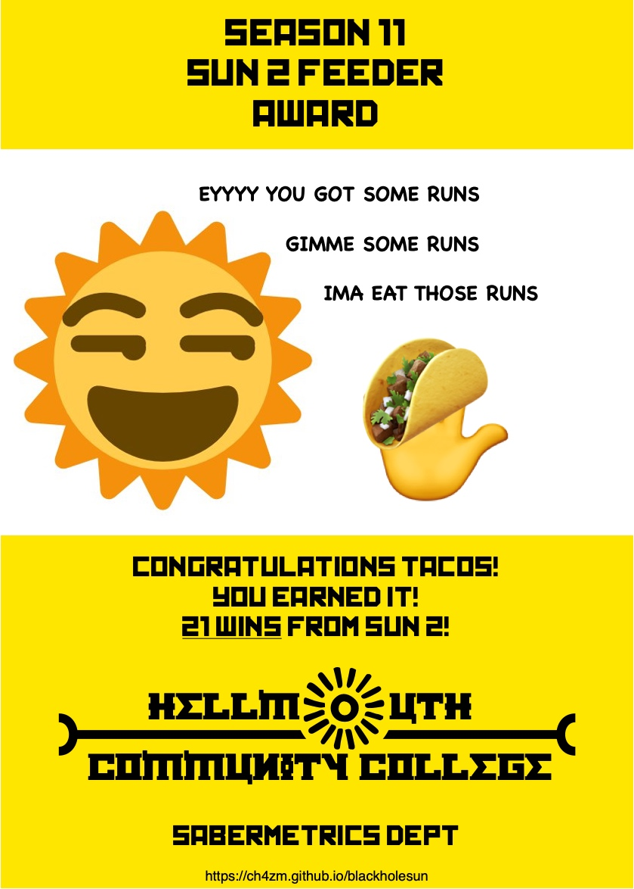
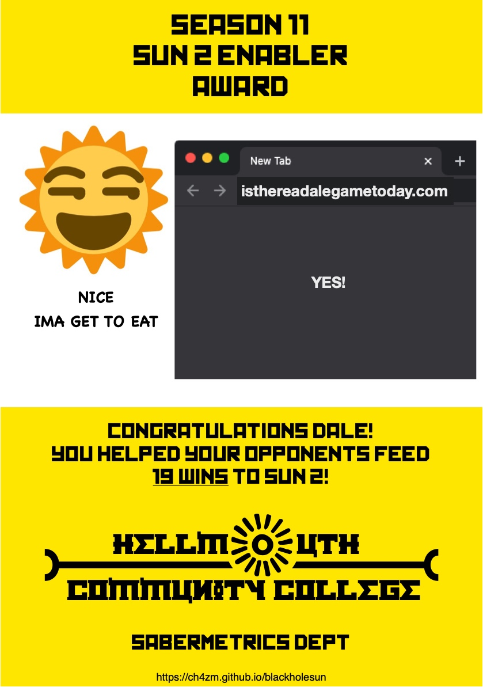
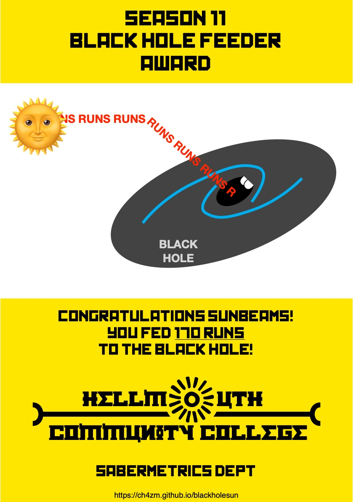
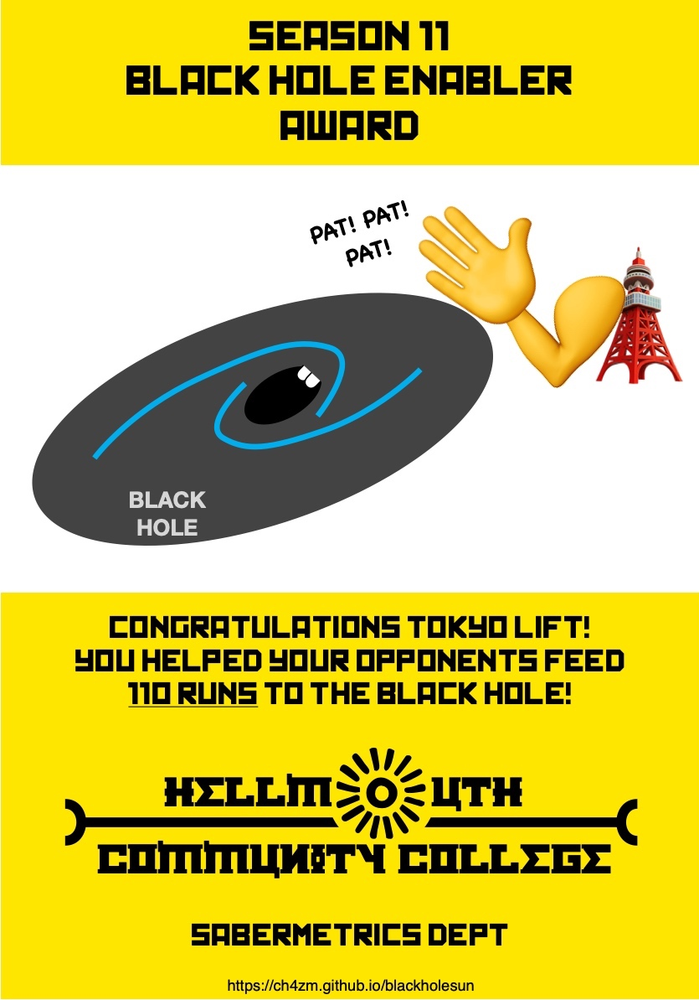
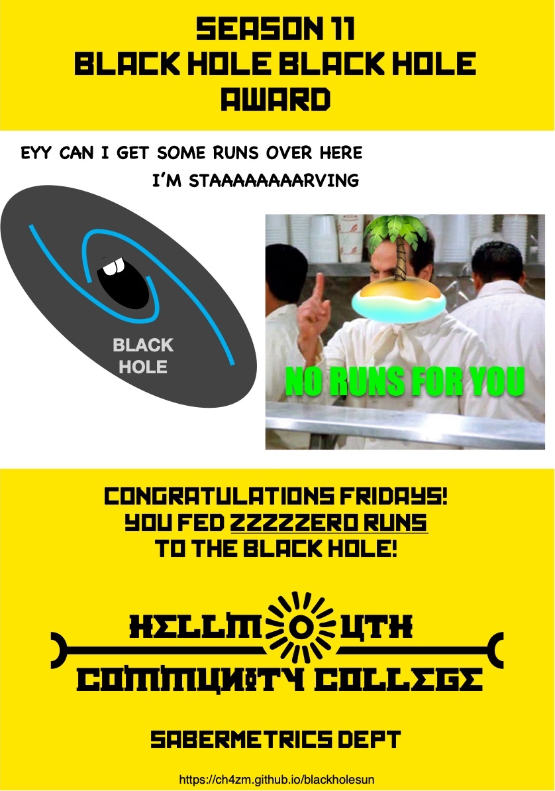
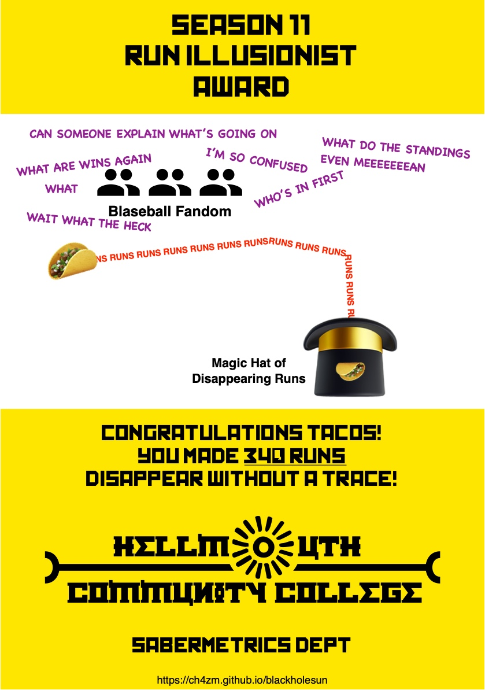
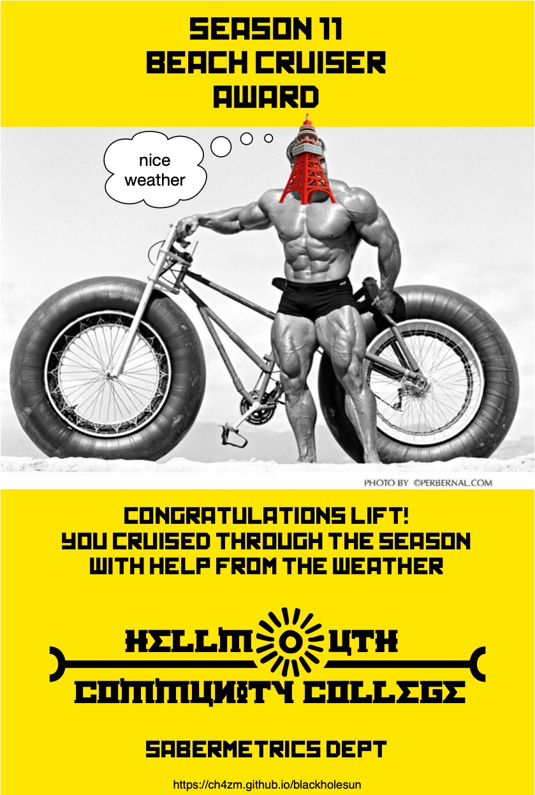
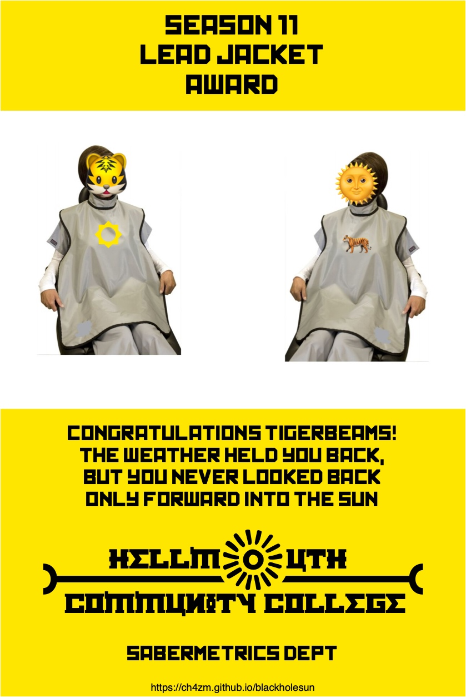
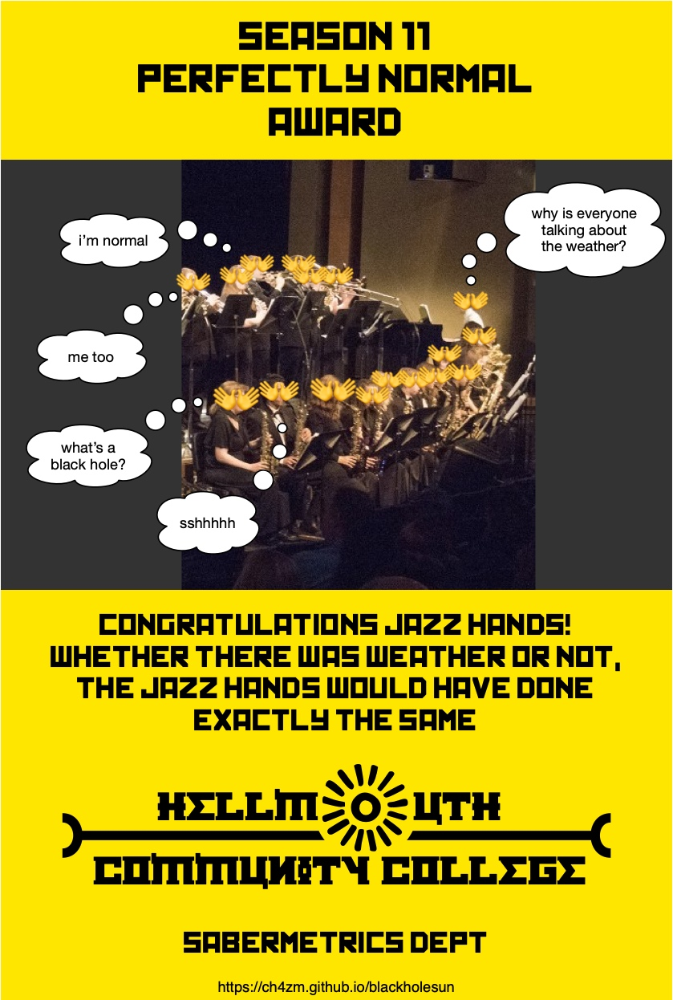

# Black Hole Sun Awards

This page hosts the Black Hole Sun awards
given out by the Hellmouth Community College
Sabermetrics Department.

There are 8 Black Hole Sun awards, each listed
below. We also have two blog posts to explain
the rationale behind each award.

# The Analysis

[Analysis of Season 11 Weather, Wins, and Runs](blackholesun_1weatherwinsruns.md)

[No Weather Thought Experiment](blackholesun_2noweather.md)

# The Awards

## Sun 2 Feeder: Most Runs Fed to Sun 2

Awardee: **Unlimited Tacos**

## Sun 2 Enabler: Most Runs Allowed to Sun 2

Awardee: **Miami Dale**

## Black Hole Feeder: Most Runs Fed to Black Hole

Awardee: **Hellmouth Sunbeams**

## Black Hole Enabler: Most Runs Allowed to Black Hole

Awardee: **Tokyo Lift**

## Black Hole Black Hole: No Runs Allowed to Black Hole

Awardee: **Hawai'i Fridays**

## Run Illusionists: Making The Most Runs Disappear

Awardee: **Unlimited Tacos**

## Beach Cruiser: Most Helped by Weather

Awardee: **Tokyo Lift**

## Lead Jacket: Most Hindered by Weather

Awardee: **Hellmouth Sunbeams/Hades Tigers**

## Most Perfectly Normal Team

Awardee: Breckenridge Jazz Hands

