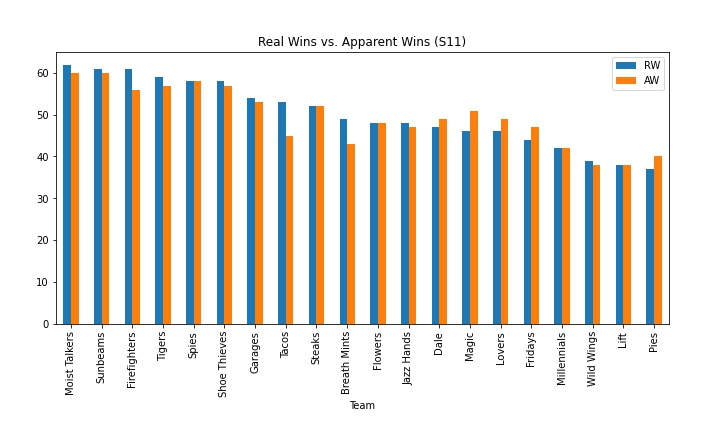
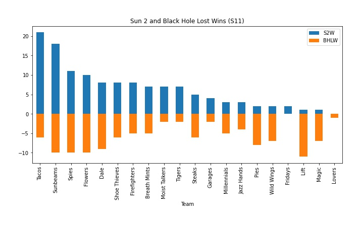
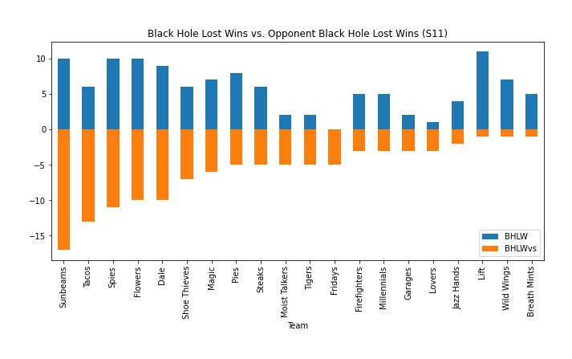
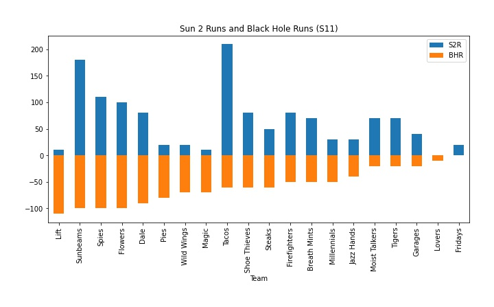
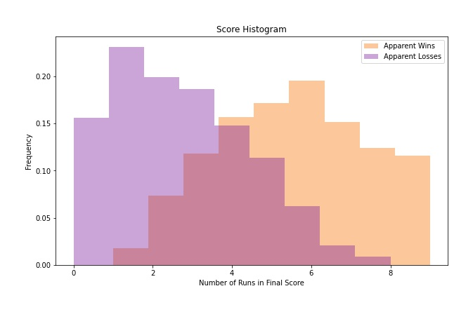

# Analysis of Season 11 Weather, Wins, and Runs

**By [Ch4zm of Hellmouth](https://twitter.com/ch4zm_of_hell), Sabermetrics Department, Hellmouth Community College**

Season 11 introduced some wild new weather, so we decided to pick
through the smouldering pile of rubble that the weather made of math
(which was, by the way, officially canceled on the first day of the season)
and try and figure out what happened.

# Weather

This season there were two types of weather: **Sun 2** weather, and **Black Hole** weather.

* In Sun 2 weather, when a team scores 10 or more runs, 10 runs are eaten by
  Sun 2, the team that scored 10 runs gets an additional win, and their score
  is reset to zero (or whatever is left after 10 runs are subtracted).

* In Black Hole weather, when a team scores 10 or more runs, 10 runs are eaten
  by the Black Hole, and the team that _did not_ score 10 runs has 1 win taken
  away.

One can quickly imagine all sorts of weird scenarios (having a 9-4 record just 8 games 
into the season) and befuddling statistics (wins per win? games per game?).
But the biggest change that the weather brought about is that _wins are considered objects_
and losses aren't, so what matters at the end of the season is not the number of
wins versus the number of losses, it's the total number of wins.

This means we have to throw our traditional metric of team performance (win-loss record,
or games above a .500 average) out the window.

## Basic Terminology

Before we dive into the numbers, let's go through a few different types of "wins" (you will
see these terms throughout the analysis):

* **Apparent Win** - a win that comes from having the most number of runs on the board
  when a game ends (the score that someone just checking box scores in the newspaper
  would see)

* **Real Win** - a win that comes from _either_ an apparent win _or_ from Sun 2.

* **Fair Win (hypothetical only)** - a hypothetical win that would come from having the
  most number of runs cross the plate (regardless of weather). Basically, how wins worked
  in Seasons 1-10.

* **Sun 2 Win** - a win that comes from Sun 2 (scoring 10 runs and then looping back
  to 0)

* **Black Hole Lost Win** - a win that is lost because the opposing team scores 10 runs
  and then loops back to 0)

* **RWAWR** - real wins to apparent wins ratio (measure of how many extra wins came from weather)

## How much weather did each team see?

Here is a chart showing the percentage of games each team spent in each type
of weather. Each team had roughly 50/50 odds of getting Sun 2 or Black Hole weather.

# Wins

## How did Sun 2 and Black Hole affect wins?

If we compare apparent wins (getting a win because you had the most runs at the end of a game)
with real wins (apparent wins, plus Sun 2 wins, minus Black Hole lost wins), we can get a sense
of how many extra wins came from the weather.

Teams with a RWAWR (real wins to apparent wins ratio) of over 1 were the teams that were able to
accumulate wins from Sun 2 faster than their opponents could remove wins with the Black Hole.
(These teams have a higher number of wins.)

Teams with a RWAWR less than 1 were teams who, despite having many apparent wins, were losing more
wins to the Black Hole than they could accumulate with Sun 2.
(These teams have a lower number of wins.)

This figure shows the real and apparent wins in absolute terms.
(Note the large gap between apparent and real wins for the Tacos,
the cause of the large RWAWR in the chart above.)

## Who were the Sun 2 wins/Black Hole lost wins leaders?

The figure below shows teams ranked by number of Sun 2 wins.
(Note: the Black Hole Lost Wins in this chart represent lost wins
_for that team's opponents_.)

The Tacos and Sunbeams are far and away the leaders in Sun 2
wins, with the rest of the Wild Low division rounding out the
top 5 Sun 2 win leaders.

Re-sorting by the most black hole lost wins shows that the
Tacos and Sunbeams were also leaders in the number of Black Hole
Lost Wins conferred upon their opponents. Again, Wild Low
rounds out the remainder of the top 5 here.

## Who gave up the most wins to Sun 2?

We have seen that teams in the Wild Low division earned many Sun 2
and Black Hole wins, but which team gave up the most runs to Sun 2?
The Dale ended up allowing 190 runs to Sun 2, which means the Dale
essentially handed out 19 free wins to their opponents.

## Who gave up the most wins to the Black Hole?

Next, we sort teams by the number of wins the team had taken away by
the Black Hole. Teams at the top (er, bottom?) of this list are teams
that appeared to be doing much worse than they actually were, but
kept having wins erased by other teams during Black Hole weather.

The Lift emerge as the team that was hammered the most by Black Hole
weather, which makes sense - they went into a hole early in the season
and never got out, divebombing straight into enhanced partytime.

# Runs

## How did Sun 2 and Black Hole affect runs?

We saw above how the weather affected wins, and what extra fraction
came from weather giving wins or taking wins away, but what was the
effect on runs? 

For this, we use a statistic called RRARR (real runs to apparent runs ratio).
This takes the total number of runs scored by a team (including runs eaten by
the weather) and compares to the number of apparent runs (runs that showed up
in the final box score of the game).

For example, if a team scored 26 runs in a game, only 6 runs would show up on the
board and the remaining 20 would be eaten, so the RRARR is 26/6 = 4.33.

Because runs cannot be taken away by weather the way wins can, all teams have a ratio
greater than 1, but a larger ratio means the team consistently scored runs that were
eaten by Sun 2 or Black Hole. And just like the RWAWR stat, we see Wild Low take over
the top five slots for the RRARR stat.

And here is the same chart in absolute terms, next to the chart of real wins vs. apparent wins
(the two charts share an x-axis for easier cross-comparison):

## Who were the Sun 2/Black Hole runs leaders?

The figure below shows teams ranked by most number of Sun 2 runs scored.
Tacos and Sunbeams are at the top, as expected, with the Tacos taking first
place.

Sorting the same data by Black Hole runs shows that the Sunbeams beat out the Tacos for
most runs fed to the Black Hole.

## Who gave up the most runs to Sun 2?

The Dale gave up the most wins to Sun 2, so in consequence they also
gave up the most runs to Sun 2:

## Who gave up the most runs to the Black Hole?

Likewise, the Lift gave up the most wins to the Black Hole, so they gave up the most runs to
the Black Hole:

## Histogram of Scores

Because of the unusual nature of looping around at 10 runs, teams with 8 or 9 runs in late
innings often found themselves in a precarious position, where a game could be lost with a
home run in the 9th. This means that despite having the maximum number of runs possible,
a team with 9 runs would be less likely to win a game than teams with 8 runs.

The chart below shows a histogram of winning and losing final scores. A histogram is a way of
plotting the frequency that a certain variable (number of runs scored) takes on a certain range
of values. The location of the peaks in a histogram indicate the most common values. (Note that
the actual values on the y-axis are not particularly useful here.)

By plotting a histogram of all of the numbers of runs scored by a single team, and plotting
winners and losers separately, we can see a pattern emerge. The most common number of runs to
have scored in a victory was around 6. The most common number of runs to have scored in a loss
was around 1.

Of course, we can't say from this that the best strategy is to score 6 runs and stop. This
histogram doesn't take into account the many types of wins, or the broader strategy going on.

