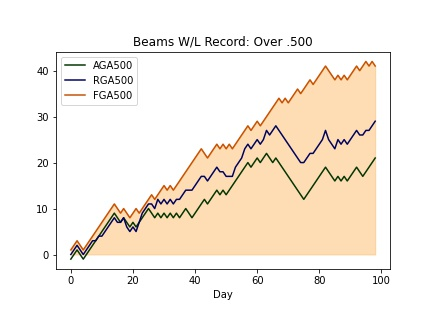
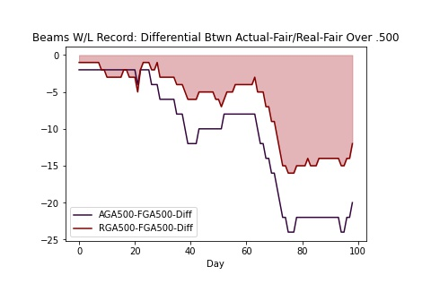
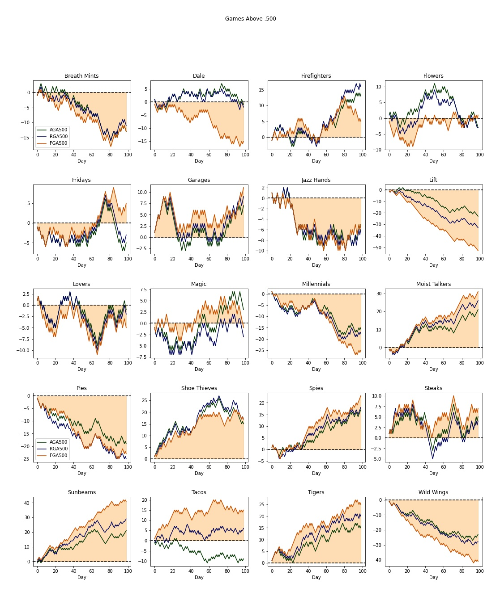

# The "No Weather" Thought Experiment

**By [Ch4zm of Hellmouth](https://twitter.com/ch4zm_of_hell), Sabermetrics Department, Hellmouth Community College**

One of the first questions that arises once people learn about
the Sun 2/Black Hole mechanisms is, "What if there was no Sun 2
or Black Hole?" (No, not many people like the new weather.)

We decided to investigate how the weather would have changed the
outcome of different games.

[Link to Jupyter notebook used to generate these figures](https://github.com/ch4zm/black-hole-sun-notebook)

## Method

To understand how the weather affected each team and its performance
during the season, we looked at a team's games above .500 (how well
a team is doing compared to a 50/50 split of all games).

Games above .500 is calculated as wins divided by total games.

However, because wins were treated as objects during Season 11, 
and losses were not used to calculate the final league standings,
we also used a second method for calculating the win/loss percentage
that would ignore the losses each team accumulated.

In order to allow comparing wins across a common baseline, we introduced
**common baseline losses**, where losses accumulate at a rate of one every
two games (in other words, the loss record if each game was a coin toss).

## Definitions

We introduce one new win type:

* **Fair Win** - a game is considered a fair win if the number of runs that
  actually crosses the plate is greater than the opponent's. This is a measure
  of number of wins if weather had not been in play.

As a reminder, the other win types are:

* **Apparent Win** - a win is considered an apparent win when the team with the
  most number of runs on the board at the end of the game wins. This quantity
  accounts for the weather but is not affected by it.

* **Real Win** - a real win is an actual win, or a win received from Sun 2
  (Black Holes take away from Real Wins)

And a few definitions for games above .500:

* **Games Above .500 (GA500)** - games above .500 is (in a normal
  blaseball season) a measure of how well a team is doing.
  It uis calculated as the number of wins divided by the number of games.
  The higher above .500 you are, the better your team is doing.

* **Fair Games Above .500 (FGA500)** - number of fair wins minus number of losses

* **Apparent Games Above .500 (AGA500)** - number of apparent wins minus number of losses

* **Real Games Above .500 (RGA500)** - number of real wins minus number of losses

Note that for the **common baseline losses** we do not calculate Games Above .500 using the
actual losses from the season, we use the baseline loss rate of 1 loss per 2 games.

## Example Team: Sunbeams

Before we look at the win-loss records for all teams, we start by looking at a
single team so we can understand what the graphs mean.

Here is a chart of the Sunbeams' win-loss record, calculated using apparent wins
(AGA500), real wins (RGA500), and fair wins (FGA500).

The first thing we notice about this chart is that the FGA500 is much higher than
the AGA500 or RGA500. In other words, if it were not for the weather, the Sunbeams
would have won many more games (which is saying something, since the Sunbeams already
crushed the entire league with the limitation of the weather).

In that sense, the weather can be thought of as having an equalizing effect for
teams playing against the Sunbeams. The Beams very rarely benefitted from the weather
by winning games they should not have.

Interestingly, the Sunbeams went through a period (Day 60 thru 75) where they
continued to produce a huge amount of runs but actually went through a losing
streak.

The AGA and RGA lines track together closely, which indicates that when
the Sunbeams racked up the runs via weather (real wins), they usually also
won the game by having the highest score on the board at the end (apparent wins).

### GA500 Differentials

We took one additional step, which was to compute the difference between the
games above .500 if we counted the apparent or real wins, and the games
above .500 if we counted the fair wins (ignoring wins from the weather
and not having any runs disappear).

If the difference between the AGA500 (or RGA500) and the FGA500 is **negative**, it
indicates that the team would have been doing better with fair rules, no weather,
and no runs disappearing.

If the difference between the AGA500 (or RGA500) and the FGA500 is **positive**,
it means the team is being helped by the weather and by their opponents looping
every 10th run, and that their record is better than it would be with normal\*
blaseball rules from Season 1 - Season 10.

\* = We are _really_ stretching the use of the term normal here.

Here are those games above .500 differentials for the Sunbeams:

In this chart we are highlighting the area under the real games above .500 curve.
We can see that same streak of losses (Day 60-75) that consisted of a series of
losses that were purely due to the Sunbeams looping. It causes a drastic drop in
the difference between the real games above .500 and the fair games above .500.

## All Teams

We now present the same chart, but for all teams:

We will analyze these results below.

### GA500 Differentials

From the above win-loss charts, we can obtain the following charts
of the difference between the real and fair (and apparent and fair)
games above 500:

and without the actual games above .500 stat (so the scales are more reasonable):

## Analysis of GA500 Differentials

We can spot a couple of significant trends from these win-loss charts:

* The **Lift** benefitted greatly from the weather - throughout the season,
  their win-loss record was propped up by wins from the weather throughout
  the season. Not only did the Lift fail to get apparent wins (winning
  by having the most runs on the board at the end), if it hadn't been for
  the weather, they would have done even worse.

* The **Wild Wings** had a similar experience to the Lift, except that they were
  even worse at getting apparent wins. During the middle third of the season,
  the Wild Wings were losing badly despite putting runs on the board and
  keeping their real wins up with Sun 2.

* The **Pies** also have a similar story to the Lift and Wild Wings, just a little
  less dramatic.

* The weather again emerges as having an equalizing effect - making better
  teams like the Sunbeams worse and making worse teams the Lift and Wild Wings
  better.

* The **Dale** managed to pull off a streak of wins where they were outscored
  but won the game thanks to the final score on the scoreboard, so if no weather
  had been in effect, the Dale would have performed worse.

* The **Sunbeams**, **Tigers**, and **Spies** were all top-performing teams during
  the season, but the Tigers and Sunbeams were held back the most by weather.

* The **Sunbeams** were hit with many black hole lost wins by their opponents,
  causing their real wins to go down, so as we mentioned previously, had there
  been no weather, the Sunbeams would have been even more dominant.

* The **Tacos** had an unsual mix of high number of runs from the weather and
  high number of apparent losses (where they had the least number of runs on the
  board at the end). Anyone who was not following the weather and was only looking
  at the final score would think that the Tacos had done terribly throughout the
  season.

* The **Jazz Hands** had the most normal season of everyone, with very few deviations
  between their real games above 500 and their fair games above 500.

## Introducing a Common Baseline

One last step that we took, in order to eliminate the (meaningless) number of losses
accumulated by each team, was to generate a common baseline for team losses. Namely,
the actual number of losses a team had was replaced with the loss record of a 50/50
team (one loss accumulated every two games).

Below is the win-loss chart adjusted for the common loss baseline. This chart is a
more accurate representation of each team's performance independent of one another
and independent of the weather.

### GA500 Differentials with Common Baseline

Here are the same games above .500 differential charts as shown above, but this time
adjusted for common baseline losses. Note that some of the trends are more exaggerated
while others are less pronounced, but the general trends still hold.

and without the actual games above .500 stat (so the scales are more reasonable):

## Conclusion

We can draw a couple of conclusions from all of this:

* Lift were cruising through their near-record-bad season with a lot of assistance from
  the weather; without it, they may have finished the season with a single-digit win column.
  For this reason, we decided to award the Lift the "Beach Cruiser" award - cruising through the
  season thanks to a big boost from the weather.

* The Tigerbeams were held back by the weather throughout the entire season, continually
  outperforming their opponents and burying them in runs, but still accumulating losses
  thanks to looping. We decided to award the Tigerbeams the "Lead Jacket" award - constantly
  being held down by the weather.

* The Tacos made a lot of runs disappear and lost a lot of blaseball games in the process.
  They kept their fair wins and real wins fairly close, but that was mainly due to so many of
  their wins coming from the weather and outscoring their opponents. When the wins went up due
  to weather events, fair wins went up because the Tacos were scoring more runs, but apparent wins
  continued to drop because the Tacos usually lost after looping back.
  We decided to award the Tacos the "Run Illusionists" award, for their ability to make so many runs
  disappear from the scoreboard and artificially inflate the win-loss record until no one had any
  idea what the standings meant.

* Jazz Hands were totally normal. No weather happening in Breckenridge. Jazz Hands don't
  know what you're talking about. We award them the "Totally Normal" award.
